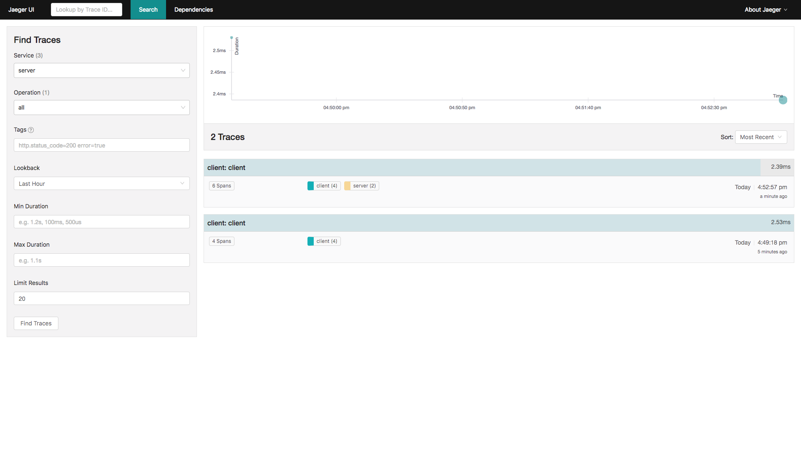
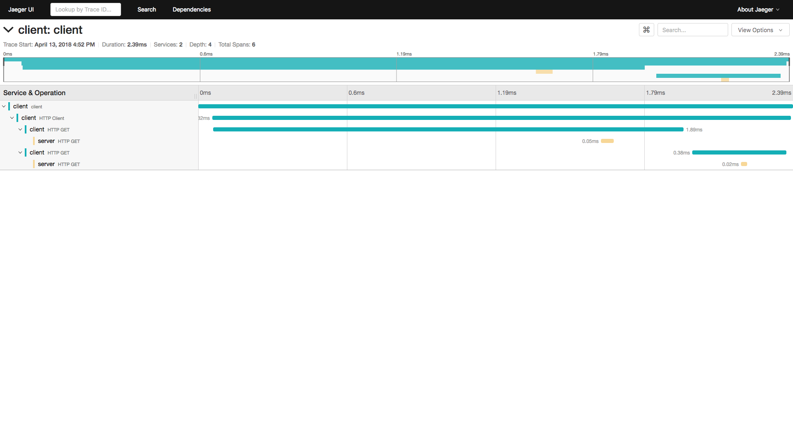

# go-jaeger-trace

## Start

```bash
$ docker-compose up -d
```

## Run Server

```bash
$ go run server/main.go
```

Output:

```bash
2018/04/13 16:52:55 Initializing logging reporter
listening to port *:8080. press ctrl + c to cancel
```

## Run Client

```bash
$ go run client/main.go
```

Output:

```bash
2018/04/13 16:52:57 Initializing logging reporter
2018/04/13 16:52:57 Reporting span 9ad925450ab9dba:420f7c605e0b8f01:6568e0797064c901:1
2018/04/13 16:52:57 {"message": "hello!"}
2018/04/13 16:52:57 Reporting span 9ad925450ab9dba:3019c48aa8106cf4:6568e0797064c901:1
2018/04/13 16:52:57 Reporting span 9ad925450ab9dba:6568e0797064c901:9ad925450ab9dba:1
2018/04/13 16:52:57 Reporting span 9ad925450ab9dba:9ad925450ab9dba:0:1
```

## UI

Available at [http://localhost:16686/](http://localhost:16686/). View registered services:



The spans:



## Stop

```bash
$ docker-compose down
```